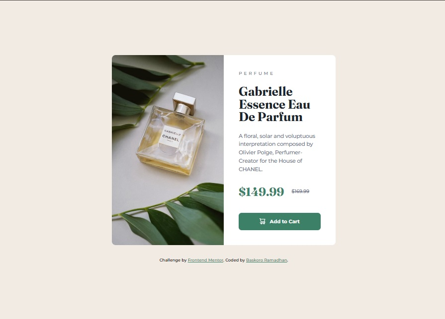

# Frontend Mentor - Product preview card component solution

This is a solution to the [Product preview card component challenge on Frontend Mentor](https://www.frontendmentor.io/challenges/product-preview-card-component-GO7UmttRfa). 

## Table of contents

- [Overview](#overview)
  - [The challenge](#the-challenge)
  - [Screenshot](#screenshot)
  - [Links](#links)
- [My process](#my-process)
  - [Built with](#built-with)
  - [What I learned](#what-i-learned)
- [Author](#author)

## Overview

### The challenge

Users should be able to:

- View the optimal layout depending on their device's screen size.
- See hover and focus states for interactive elements.
- Experience an accessible interface with proper semantic structure.

### Screenshot



*Note: Please replace this with your actual project screenshot once deployed.*

### Links

- Solution URL: [https://github.com/BaskoroR725/05-Product-preview-card-component.git](https://github.com/BaskoroR725/05-Product-preview-card-component.git)
- Live Site URL: [https://baskoror725.github.io/05-Product-preview-card-component/](https://baskoror725.github.io/05-Product-preview-card-component/)

## My process

### Built with

- **Semantic HTML5** - Using landmarks like `<main>`, `<article>`, and `<picture>` for better SEO and Accessibility.
- **Sass (SCSS)** - Organized using a modular architecture (Abstracts, Base, Components).
- **BEM (Block Element Modifier)** - Naming convention for clean and scalable CSS.
- **Mobile-First Workflow** - Ensuring core functionality on small screens before scaling up.
- **Modern CSS Features**:
  - **CSS Grid & Flexbox** for layout.
  - **Logical Properties** (e.g., `margin-block`) for better maintainability.
  - **Fluid Typography** using `clamp()`.
  - **Responsive Units** (`rem`, `em`) for scalability.
- **Local Font Hosting** - Self-hosting fonts to bypass CORB/CORS issues and improve performance.

### What I learned

This project served as a deep dive into professional frontend engineering workflows. Key takeaways include:

1. **Art Direction with the `<picture>` element**: Instead of relying on CSS background-images, I used `<picture>` to serve optimized images based on the user's viewport.
2. **Accessibility (a11y) Best Practices**: I implemented a `.visually-hidden` class to provide screen readers with context for the "Original Price," ensuring users with visual impairments receive the full information.
3. **Advanced Sass Architecture**: I learned how to use `@mixin` and `@content` to abstract media queries, making the codebase much cleaner and easier to maintain.
4. **Resilience against CORB**: Encountering and solving Cross-Origin Read Blocking by switching from Google Fonts CDN to local hosting.

```html
<picture class="product-card__image">
  <source media="(min-width: 37.5em)" srcset="./images/image-product-desktop.jpg">
  
</picture>
```

```html
&__title {
  font-family: $ff-accent;
  font-size: clamp(2rem, 10vw, 2.125rem);
  line-height: 1;
}
```

### Author

Baskoro Ramadhan

